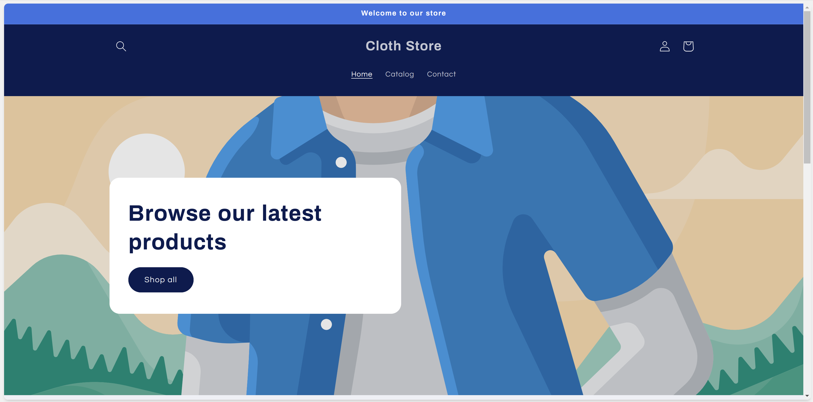
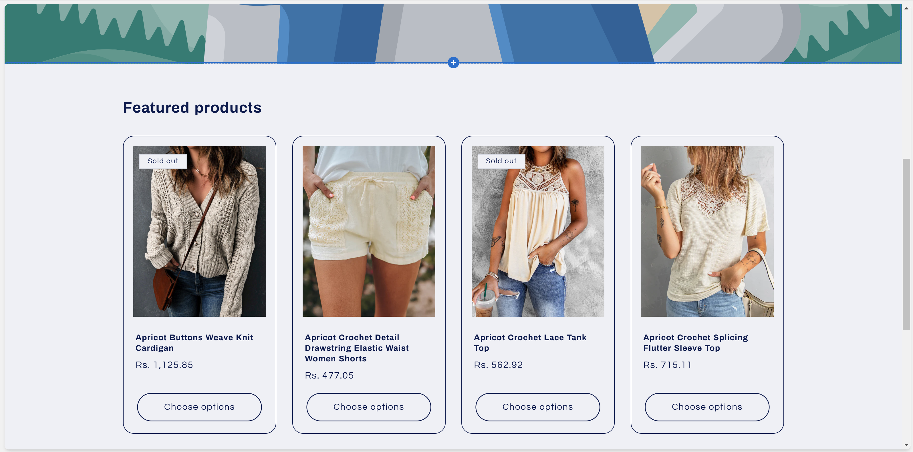
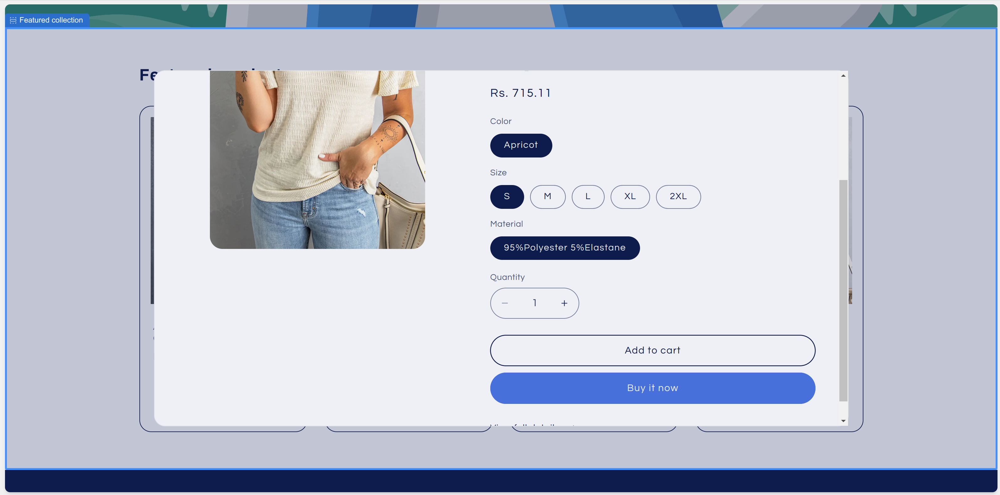
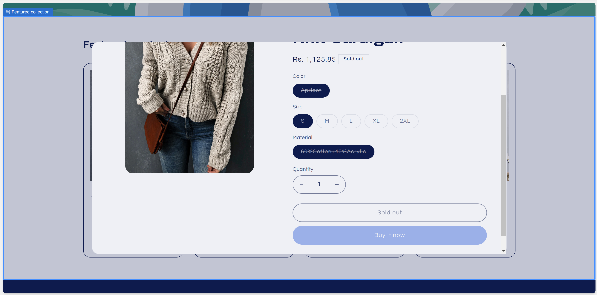
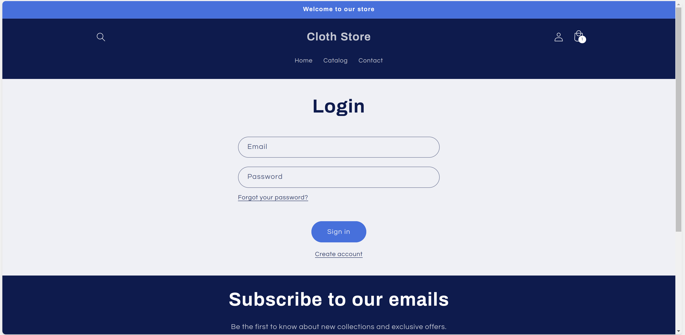
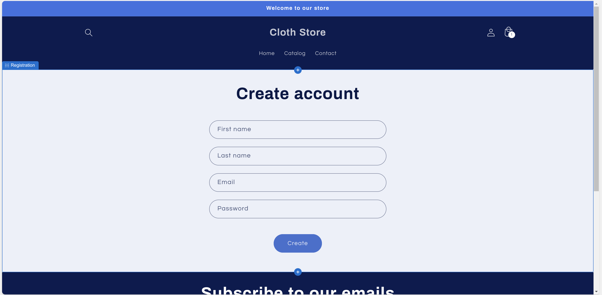
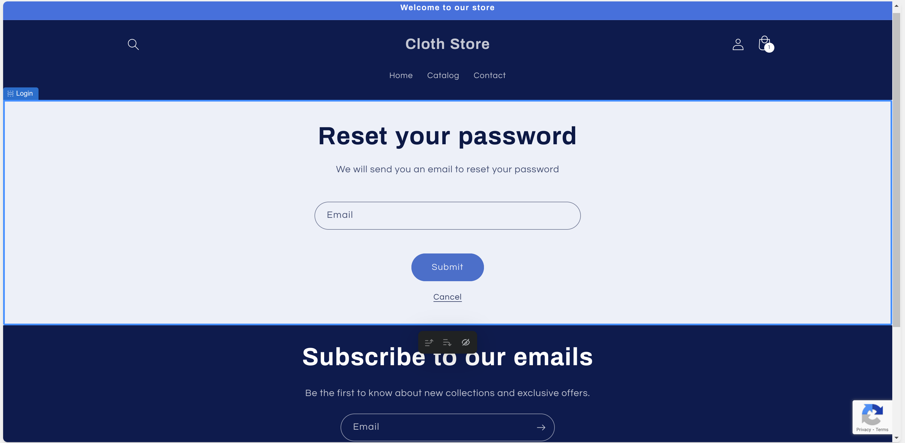
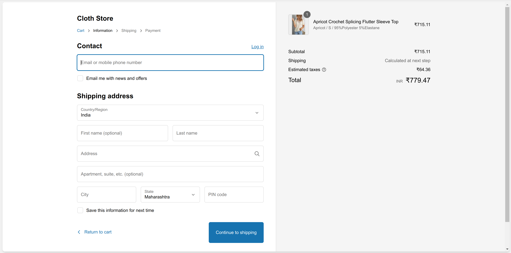

# Cloth Store
[](https://shopify.com/)
[](http://makeapullrequest.com)
[](https://github.com/tanushreee10/ClothStore)

### Getting Started
```
git clone https://github.com/tanushreee10/ClothStore.git
cd ./ClothStore
```
Take all the files and import them to your shopify store.
- Add the Payment Gateway
- Add the Theme (Available at Shopify)
- Publish the store

### Screenshots








